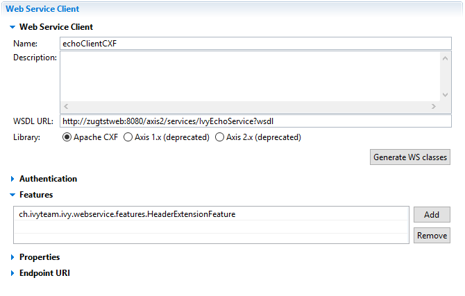

# CXF Feature Example
Provides a simple example of a custom CXF feature that can be used within Axon.ivy.

## Requirements
* Java 8.
* Maven 3 or later for building.

## Download
Download or clone the latest **CXF Feature Example** project [here] (https://github.com/ivy-samples/cxf-feature-sample.git)!

## Local Build
    mvn clean install

## Installation
1. Add the generated jar file cxf-feature-sample-0.1.0.jar file to your Axon.ivy project classpath.
2. Add the included feature class HeaderExtensionFeature to your list of features in the Web Service Clients Editor window.

